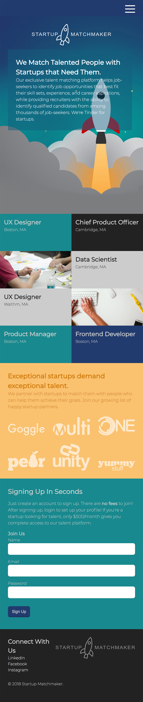

# HOMEWORK

## FEWD Week #3: Advanced Topics in CSS

<br>

### Description

During Class 6, we're going to start building the Startup Matchmaker website.  We'll be building it using **Responsive Web Design** techniques and following the **mobile-first** approach.  That means, we'll be building the mobile version of our site and then enhancing using **media queries** for progressively larger screens.

For your homework for Class 5, create a basic website that will be our mobile site skeleton:

1. Add the [Google Font Montserrat](https://fonts.google.com/specimen/Montserrat) with the light and regular styles and set it as the base page font.
```html
<link href="https://fonts.googleapis.com/css?family=Montserrat:200,400" rel="stylesheet">
```
2. Set up your base page with the following structure:
```
  <nav></nav>
  <section></section>
  <section></section>
  <section></section>
  <section></section>
  <footer></footer>
```
3. Give each of the sections and id as follow: how, openings, startups, join.  We'll be using these later as anchors for our menu, but they are useful for distiguishing the sections in our CSS as well.
4. Set the page background color to: #7c7d7f.
5. Set the nav background color to: #213b6e and link color to white.
6. Set the #how background to the launch.jpg image and make sure it spans the entire viewport height and font color to white.  Make the background color of the box behind the text rgba(20,93,125,.5);
7. Set the #openings font color to #222.
8. Set the #startups background color: #fac16f and font color to: #ce7800.
9. Set the #join background color to: #17898e and font color to: #ccc.
10. Give the footer a background color of: #222 and font color of: #ccc.
11. Make the boxes in the openings section using divs with flexbox and flexwrap.
12. Make the logos in a grid if you can!


---

## Content

### How

We Match Talented People with Startups that Need Them.


Our exclusive talent matching platform helps job-seekers to identify job opportunities that best fit their skill sets, experience, and career aspirations, while providing recruiters with the ability to identify qualified candidates from among thousands of job-seekers. We're Tinder for startups.

### Openings

UX Designer
Boston, MA

Chief Product Officer
Cambridge, MA

Data Scientist
Cambridge, MA

UX Designer
Walthm, MA

Product Manager
Boston, MA

Frontend Developer
Boston, MA

### Startups

Exceptional startups demand exceptional talent.


We partner with startups to match them with people who can help them achieve their goals. Join our growing list of happy startup partners.

### Join

Signing Up In Seconds


Just create an account to sign up. There are no fees to join! After signing up, login to set up your profile! If you're a startup looking for talent, only $500/month gives you complete access to our talent platform.

### Footer

Connect With Us

Linkedin

Facebook

Instagram

---

---

### Resources

[Google's Guide to Google Fonts](https://developers.google.com/fonts/docs/getting_started)

[CSS Tricks Complete Guide to Using Flexbox](https://css-tricks.com/snippets/css/a-guide-to-flexbox/)

[CSS Tricks Complete Guide to Using Grid](https://css-tricks.com/snippets/css/complete-guide-grid/)


