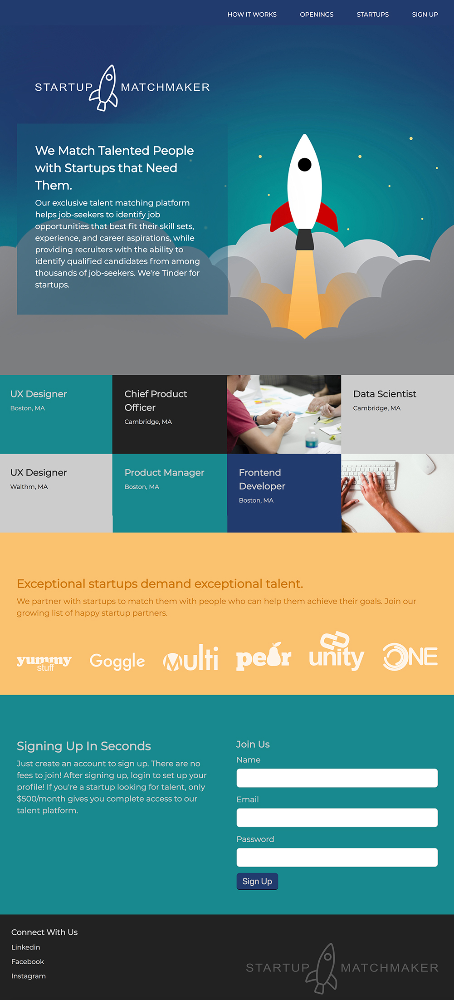

# HOMEWORK

## FEWD Week #3: Advanced Topics in CSS

<br>

### Description

You've got a good headstart on building the Startup Matchmaker website and making it responsive.  For your homework for Class 6, finish up the responsive features and make sure your site scales nicely for larger screen devices:

1. Add two media queries:

```css
@media (min-width: 768px) {
}
@media (min-width: 992px) {
}
```

2. Make the div in the how section 75% in the mid-sized devices and 50% on the largest devices.

3. Change the openings to be 3 items across on mid-sized devices and 4 items across on large devices.

4. Make the logos in the startup section 3 across on mid-sized devices and 6 across on large devices.

5. In the join section, make the form part be in a separate column on both mid-sized and large devices.

6. Use absolute positioning to place the footer logo in the bottom right corner on both mid-sized and large devices.

7. Add the menu and make it display or hide based on the device size!  Make sure the hamburger icon displays when the menu doesn't.

BONUS:

Can you change the base styles to use floats and use @supports for grid and / flexbox?

---

## Hints

### Media Queries

Remember that media queries cascade, so you need to add them **after** the normal styles!

Also, remember that you only have to modify the properties that you want to change.  That means, you don't have to worry about copying the font or background colors, for example, into your media queries because we're only making changes to the layout.

---

---

### Resources

[Using media queries](https://developer.mozilla.org/en-US/docs/Web/CSS/Media_Queries/Using_media_queries)

[Responsive Web Design](https://www.w3schools.com/css/css_rwd_mediaqueries.asp)


