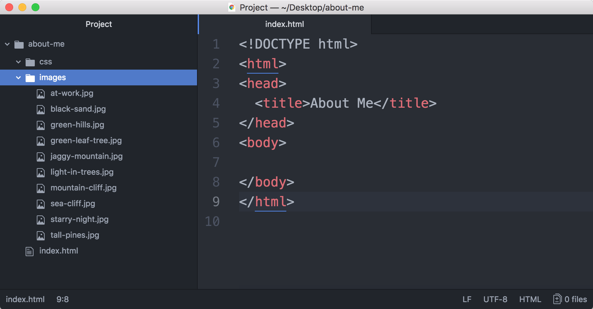

### CLASS 2 HOMEWORK

## YOUR PERSONAL WEBSITE
#### Due: Monday, October 15

This week, you'll be building a personal website to share with your classmates like the one shown below.  You should have already prepared for this assignment by:

1. Creating a folder for the website you'll be building.
2. Adding folders for your images and styles.
3. Adding a basic index.html file with boilerplate.
4. Adding at least 5 pictures to your images folder.

So far, your project should resemble the following:



## DEVELOPING YOUR CONTENT

5. For this assignment, you'll be writing about yourself, so there's no starter text.  Don't worry, you only need to create the following:
- A headline for your webpage.
- A brief introduction of 2 - 3 sentences about yourself.
- A short description of what you do at work.  Again, 2 - 3 sentences is fine.
- A short introduction and list of your favorite pastimes.

## STRUCTURING YOUR WEBSITE CONTENT

### Semantic Page Structure

6. Once you have your content prepared, you'll need to add it to your html page.  Start by sectioning off the page with the `header`, `main` and `footer` sections in the page body.
<details>
  <summary><strong>GET A HINT</strong></summary>
  
```html
<!DOCTYPE html>
<html>
<head>
  <title>About Me</title>
</head>
<body>
  <header></header>
  <main></main>
  <footer></footer>
</body>
</html>
```

</details>

### Header Section

7. Add your headline to the `header` section and wrap it in an appropriate tag (you'll want this to be the largest one on the page).
8. Add your introductory paragraph to the `header` (it's a paragraph, so use the appropriate tag). 
9. Next, add your `nav` tags in the header.
10. Inside the `nav`, add an anchor tag for each of our main sections: work, hobbies, gallery.  We'll be using ids with the same names, so go ahead and add the href attributes for them (remember that the name of the id is preceeded by a `#`).  

<details>
  <summary><strong>GET A HINT</strong></summary>
  
```html
<!DOCTYPE html>
<html>
<head>
  <title>About Me</title>
</head>
<body>
  <header>
    <h1>Your Headline Here</h1>
    <p>Your introductory paragraph should go here</p>
    <nav>
      <a href="#work">work</a>
      <a href="#hobbies">hobbies</a>
      <a href="#gallery">gallery</a>
    </nav>
  </header>
  <main></main>
  <footer></footer>
</body>
</html>
```

</details>

### Main Section

11. Our main content needs to be broken down into 3 sections, each with an id corresponding to the links above.  Use an appropriate tag for each *section* :wink:.
12. Inside the work section, add your *heading* (this should be smaller than the one used previously for your headline), followed by the *paragraph* you wrote about what you do for work.
13. You'll want to wrap this heading and paragraph inside a single `div` so that you can set the work section in columns later and keep these elements together in one column.
14. Add an image that represents you at work.  This could be a logo from your company website.  Do you remember how to get an image from a website with the right-click?
15. Do the same for the hobbies section, adding a heading, intro paragraph and a list of your hobbies.  Remember to wrap them all in a `div`.
16. Finally, use what you learned about adding content images with the `img` tag and insert all of your pictures into the gallery section.

<details>
  <summary><strong>GET A HINT</strong></summary>
  
```html
<!DOCTYPE html>
<html>
<head>
  <title>About Me</title>
</head>
<body>
  <header>
    <h1>Your Headline Here</h1>
    <p>Your introductory paragraph should go here</p>
    <nav>
      <a href="#work">work</a>
      <a href="#hobbies">hobbies</a>
      <a href="#gallery">gallery</a>
    </nav>
  </header>
  <main>
    <section id="work">
      <div>
        <h2>Your Work Heading</h2>
        <p>A paragraph about what you do.</p>
      </div>
    </section>
    <section id="hobbies">
      <div>
        <h2>Your Hobbies Heading</h2>
        <p>A paragraph introducing your hobbies.</p>
        <ul>
          <li>Hobby</li>
          <li>Hobby</li>
        </ul>
      </div>
    </section>
    <section id="gallery">
      
      
      
      
      
    </section>
  </main>
  <footer></footer>
</body>
</html>
```

</details>

### Footer Section

17. The footer section is simple.  Just add a paragraph that reads: Get in touch! and follow it with a `nav`.
18. Inside the `nav`, create an anchor tag for an email address (you can make a fake one if you're concerned about privacy) and one other for your linkedin page.

<details>
  <summary><strong>GET A HINT</strong></summary>
  
```html
<!DOCTYPE html>
<html>
<head>
  <title>About Me</title>
</head>
<body>
  <header>
    <h1>Your Headline Here</h1>
    <p>Your introductory paragraph should go here</p>
    <nav>
      <a href="#work">work</a>
      <a href="#hobbies">hobbies</a>
      <a href="#gallery">gallery</a>
    </nav>
  </header>
  <main>
    <section id="work">
      <div>
        <h2>Your Work Heading</h2>
        <p>A paragraph about what you do.</p>
      </div>
    </section>
    <section id="hobbies">
      <div>
        <h2>Your Hobbies Heading</h2>
        <p>A paragraph introducing your hobbies.</p>
        <ul>
          <li>Hobby</li>
          <li>Hobby</li>
        </ul>
      </div>
    </section>
    <section id="gallery">
      
      
      
      
      
    </section>
  </main>
  <footer>
    <p>Get in touch!</p>
    <nav>
      <a href="https://www.linkedin.com/in/jenniferannmeade/">Linkedin</a>
      <a href="mailto:fake-email@gmail.com">Email</a>
    </nav>
  </footer>
</body>
</html>
```

</details>

## STYLING YOUR WEBSITE

19. Create your `styles.css` file in your `css` folder and link it to your `index.html`.
20. Go to [fonts.google.com](https://fonts.google.com/), search for and add the Raleway font in the weights of 200, 500, and 900.

<details>
  <summary><strong>GET A HINT</strong></summary>
  
  > Either choose, File > New file then File > Save As and make sure you save the file in the css folder or right-click on the css folder and choose New file.  In VS Code, you can just click the file with a plus icon next to the file name in the project area.
  
  > Go to [fonts.google.com](https://fonts.google.com/), choose the Raleway font.  Click the plus sign, then in the pop-up click on the tab for **CUSTOMIZE** and select the font weights: 200, 500, and 900.  Click back to the **EMBED** tag and copy the link tag and paste it *before* your styles.css file.
  
  ```html
<!DOCTYPE html>
<html>
<head>
  <title>About Me</title>
  <link href="https://fonts.googleapis.com/css?family=Raleway:200,500,900" rel="stylesheet">
  <link rel="stylesheet" href="css/styles.css">
</head>
  ```
</details><br>


21. Inside your `styles.css` file, add the universal selector and set the box-sizing to border-box and remove all of the margins. 

<details>
  <summary><strong>GET A HINT</strong></summary>
 
  ```css
  
  * {
    margin: 0;
    box-sizing: border-box;
  }
  ```
</details><br>


22. We're going to set some base styles that will apply to the whole page.  That means we want to use the html element as the selector. 
- Set the page background to #343434.
- Set the color of the font to #16b1b5.
- Set the font family for the page to 'Raleway', sans-serif.
- Set the font weight to 200.
- Increase the base font size to 24px.
- Give our page smooth scrolling.

<details>
  <summary><strong>GET A HINT</strong></summary>
 
  ```css
html {
  background-color: #343434;
  color: #16b1b5;
  font-family: 'Raleway', sans-serif;
  font-weight: 200;
  scroll-behavior: smooth;
  font-size: 24px;
}
  ```
</details><br>


23. Next let's tackle the header styles.
- Give the header 40px of padding.
- Set the line-height for your headline to .8.
- We need to add some margin back to the top and bottom of the p tags since we removed all margins. Add 1em of margin to the top and bottom of the paragraphs.
- We need to add some padding to the nav element to address a special phenomenon called margin collapse, which you'll be reading about next week.  So give the nav 1em of top and bottom padding. Also, decrease the font-size for the nav elements to 16px and center them.
- Finally, to style our links, change the color to white.  Add 20px of margin and padding. Transform the case to uppercase. Remove the underline.  Add a 1px solid border.

<details>
  <summary><strong>GET A HINT</strong></summary>
 
  ```css
header {
  padding: 40px;
}

h1 {
  line-height: .8;
}

p {
  margin: 1em 0;
}

nav {
  font-size: 16px;
  text-align: center;
  padding: 1em 0;
}

a {
  color: white;
  padding: 20px;
  margin: 20px;
  text-transform: uppercase;
  text-decoration: none;
  border: 1px solid white;
}
  ```
</details><br>


24. Next we'll handle the styles for the main section.
- Give the work section a background-color of #16b1b5, padding of 40px and set the font color to white.  We also need to set the column-count on this one to 2 columns.
- The hobbies section needs padding of 40px too. 
- Our gallery is going to get a column count of 3 and we're going to remove the column gap by setting it to 0.  Set the background color on the gallery to #16b1b5 like the work section.
- We used divs to wrap our column contents so that we can use the special break-inside: avoid, to keep the div contents together in one column.
- Lastly, to keep our images in check, we need to set them to width 100%.  Also, if you want to remove the space below each image, you can add a property to the img of `display: block;`.  We'll be talking about this next week.

<details>
  <summary><strong>GET A HINT</strong></summary>
 
  ```css
#work {
  background-color: #16b1b5;
  padding: 40px;
  column-count: 2;
  color: white;
}

#hobbies {
  padding: 40px;
}

#gallery {
  column-count:3;
  column-gap: 0;
  background-color: #16b1b5;
}

div {
  break-inside: avoid;
}

img {
  width: 100%;
  display: block;
}
  ```
</details><br>


25. Now all that is left is the footer.
- Set the footer to center its text (inline) elements. The nav is already receiving the styles from the nav in the header!

<details>
  <summary><strong>GET A HINT</strong></summary>
 
  ```css
footer {
  text-align: center.
}
  ```
</details><br>

## DESIGN FILE


